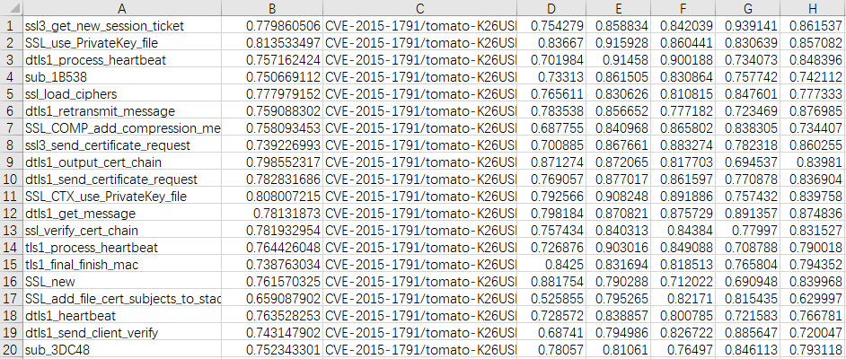

# Repository of  VulSeeker
## Introduction of VulSeeker
It's a semantic learning based vulnerability search tool for cross-platform binary. Given a vulnerability function `f`, VulSeeker can identify whether a binary program contains the same vulnerability as `f`. Currently, it support six architectures, such as X86, X64, ARM32, ARM64, MIPS32, MIPS64. If you meet any problems, please feel free to email me at gaojian094@gmail.com.


`Note: Currently, this repository contains the executable files and partial source code of VulSeeker. After we have the source code ready, we will open all of them in a few days. We will remove duplicate files and provide clearer documentation later. Thank you for your understanding.`

## Prerequisites
To use VulSeeker, we need the following tools installed
- IDA Pro - for generating the LSFG （data flow graph and control flow graph）and extracting features of basic blocks
- python2.7 - all the source code is written in python2.7 
- [miasm](https://github.com/cea-sec/miasm) - for converting assembly program to LLVM IR. We extend it to support more assembly instructions. Please directly copy the `miasm2` provided by us to the python directory of `IDA Pro`.

## Directory structure
- `0_Libs/search_program`: it contains the binary file considered as the target from which VulSeeker search vulnerability.
- `1_Features/search_program`: it contains the instruction features, control flow graph and data flow graph for each function in the target. 
- `4_Model/VulSeeker`: it is a DNN model that we have trained to use directly.
- `5_CVE_Feature`: It contains the instruction features, control flow graph and data flow graph of each version of the two vulnerabilities (CVE-2014-3508, CVE-2015-1791).
- `6_Search_TFRecord`: Tfrecord data file is a binary file that stores data and labels in a unified way. It can make better use of memory and make rapid replication, movement, reading and storage in tensorflow. 
- `7_Search_Result`: All the search result list will be stored here.

## Usage
1. We need modify the `config.py` file. All the dependency directories can be modified here. Simple modification is listed as following, but it need to follow the directory structure we defined:
```
IDA32_DIR = "installation directory of 32-bit IDA Pro program"
IDA64_DIR = "installation directory of 64-bit IDA Pro program"
```
2. We put the programs to be searched in the `VulSeeker/0_Libs/search_program` directory.
3. We run the `VulSeeker/command.py` file to generate the labeled semantic flow graphs and extract initial numerical vectors for basic blocks. The result files should be placed in the `1_Features/search_program` directory.
4. We execute the `VulSeeker/search_by_list_vulseeker.py` file to obtain embedding vectors of the functions and get the function list in descending order of similarity scores. 

` Note: Because the IDA Pro is installed in the Windows system, we complete the feature extraction and LSFG construction in Windows. Other steps can be executed in either the Linux system or the Windows system.`

## Viewing the search result
The following figure is an example of the search result.



 For each vulnerability function, there are a total of 48 compiled versions. These versions contain different architectures (X86, X64, ARM32, ARM64, MIPS32 and MIPS64), compilers (GCC v4.9 and GCC v5.5) with four optimization levels (O0-O3). 
- Column A records the function name.
- Column B is the average similarity score between the corresponding function and the vulnerability function with 48 compiled versions.
- Column C records the file to which the function belongs.
- The other items after column C are the similarity scores between a particular version of the vulnerability and the corresponding function.
